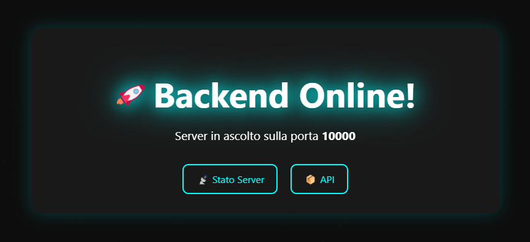
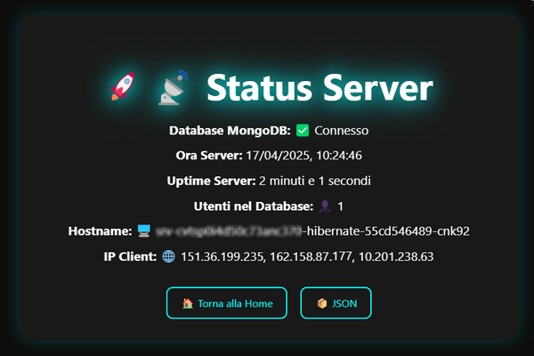

## 🗄️🔐 Auth-JWT-Backend

This repository contains a backend API for user authentication using JWT (JSON Web Tokens) 
 
with Node.js, Express, and MongoDB. 
 
It handles user registration, login, and authentication via JWT stored in HttpOnly cookies, 
 
with routes that are protected using middleware.
 
The backend of this project is connected and managed by the [Render](https://www.render.com/) site
 
and the frontend by the [Netlify](https://www.netlify.com/) site. 
 
The database is hosted on the [MongoDB](https://www.mongodb.com/) site. 
 
Environment variables must be set on the [Render](https://www.render.com/) site
 
The [auth-jwt-frontend](https://github.com/stecavalli/auth-jwt-frontend) repository is an integral part of this project.

## ✅ Features

<b>JWT Authentication:</b> Secure login and registration with JWT tokens.
 
<b>Cookie Storage:</b> JWT stored in HttpOnly cookies for enhanced security.
 
<b>Protected Routes:</b> Routes like /api/users are protected and require a valid JWT.
 
<b>User Management:</b> Register, list, and delete users (admin functionality).
 
<b>Logout:</b> Clear JWT cookie on logout.

## 🖥️ Local installation

<b> 📦 Clone the repository:</b>
 
git clone https://github.com/stecavalli/auth-jwt-backend.git
 
cd auth-jwt-backend
 

<b> 🔧 Environment Setup</b>

<i>Create a .env file (and place it in the root folder where the server.js file is located) 
 
with the following:</i>
  
JWT_SECRET=your_secret_key
 
MONGO_URI=your_mongo_database_url
  

<b> 📦 Install dependencies:</b>

npm install
  

<b> ▶️ Start the server:</b>

npm start
  

<b>When you start the server you will see something like this:</b>
  
PowerShell 7.5.0
 
PS C:\Users\Stefano\Desktop\auth-jwt-backend-master> npm start
  
backend@1.0.0 start
 
node server.js
  
Connected to MongoDB
 
Server listening on port 3001
  
<b>Open your browser and type localhost:3001</b>
 
<b>Replace 3001 with the port number the server is listening on</b>
 

## 🌐Localhost Home page

In your browser you will see something like this:
  

 

## 🚀 Deployment  
You can deploy the backend on platforms like [Render](https://render.com), [Railway](https://railway.app), or [Heroku](https://www.heroku.com/).  
 
Make sure to set environment variables such as `MONGO_URI` and `JWT_SECRET` 
 
securely in your deployment dashboard.

## 📬 API Endpoints (Used by Frontend)

<b>GET /api/users:</b> Get the list of all users (protected route, JWT required).
 
<b>GET /api/me:</b> Get the currently logged-in user's information (protected route, JWT required).
 
<b>POST /api/auth/register:</b> Register a new user.
 
<b>POST /api/auth/login:</b> Login and receive a JWT token, stored in an HttpOnly cookie.
 
<b>POST /api/auth/logout:</b> Logout by clearing the JWT cookie.
 
<b>DELETE /api/users/:username:</b> Delete a user (protected route, JWT required).

## 🛠️ Technologies

Node.js
 
Express.js
 
JWT
 
MongoDB
 
bcrypt
 
Cookies (HttpOnly)

## 🧱 Middleware

verifyToken: Middleware to verify the JWT token and protect routes.

## 🌐 Web server home page

On the Render site when you open your server's web page you will see 
 
something very similar to the following images:
  

 

